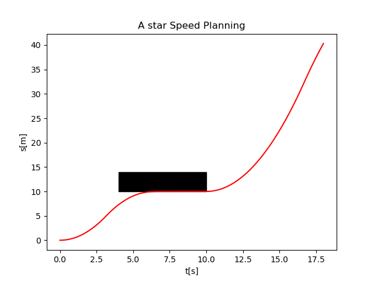

# A star Speed Planning

## 1. Description

## 2. Usage
- #### generate csv file
```
git clone https://github.com/purewater0901/a_star_speed_planning.git
cd a_star_speed_planning
mkdir build && cd buiild
cmake ..
make
./astar_speed_planning
```

- #### visualize result
```
python script/visualize.py
```

## 3. Result
- Black: Obstacle Occupied Area
- Red:   Optimal Trajectory



## 4. Reference
- #### Paper
[Hierarchical Trajectory Planning](https://www.researchgate.net/publication/322202031_Hierarchical_Trajectory_Planning_of_an_Autonomous_Car_Based_on_the_Integration_of_a_Sampling_and_an_Optimization_Method)

- #### Code
[A Star](https://github.com/daancode/a-star)


